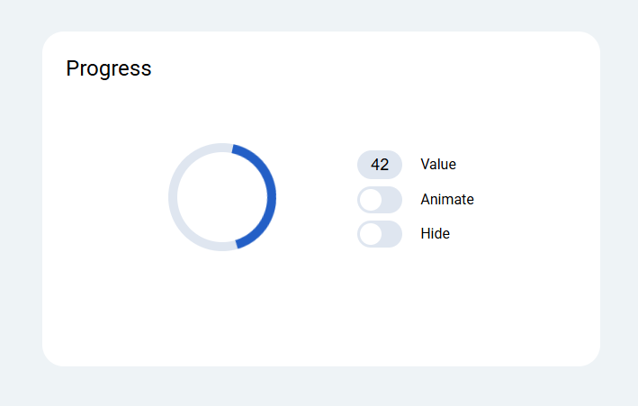

# Circular Progress Bar

## Overview

A Web Component that can be used to track down progress of any desired task. It's built with `TypeScript`, `Vite`, `SASS`, adaptive to screen size changes, and is easily customizable.

## Functionality

<ul style='display: flex; flex-direction: column; gap: 10px'>
    <li>
        One can easily regulate a progress that has already been made via corresponding <code>value</code> control, where values within <code>[0; 100]</code> range can be typed;
    </li>
    <li>
        In order to toggle animation (i.e. rotation of a progress bar) there's a corresponding <code>animate</code> control;
    </li>
    <li>
        Like in case with <code>animate</code> control, there is also a <code>hide</code> control, which, as the name suggests, can hide a progress bar completely;
    </li>
    <li>
        It's also possible to customize background color of a <code>circular-progress-bar</code>: to do that simply pass an attribute <code>color</code> with a desired value (default value is <code>white</code>).
    </li>
</ul>

## Implementation details

The project structure is basically comprised of 3 web components (each of them utilizes <code>Shadow DOM</code> to hide implementation details):

<ol style='display: flex; flex-direction: column; gap: 10px'>
    <li>
        <code>circular-progress-bar</code>
        

            Acts like a wrapper for all other components that later will be discussed here.
        

        <b>
            It's important to provide <code>settings</code> and <code>loader</code> inside the component!
        </b>
            If this condition is not satisfied, you will see a corresponding error in your console.
    </li>
    <li>
        <code>circular-progress-bar-loader</code>
        

            Component that renders two svg-elements (arc and full circle) which in such combination form a well-known progress bar!
        

    </li>
    <li>
        <code>circular-progress-bar-settings</code>
        

            Settings form that emits a custom <code>settings</code> event upon any change. This event is listened by <code>circular-progress-bar</code>, which in turn, updates <code>circular-progress-bar-loader</code>
        

    </li>
</ol>

The overall component structure inside HTML-markup looks like this:

## Tech stack

- TypeScript
- Vite
- SASS
